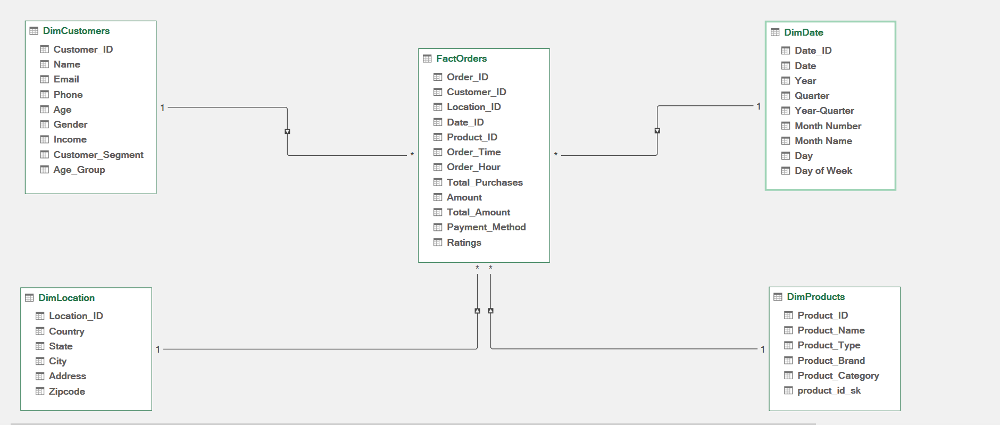
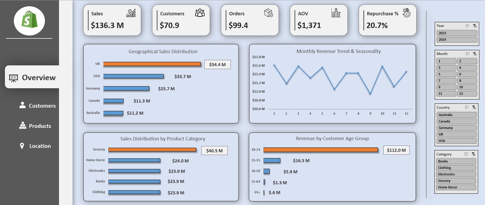
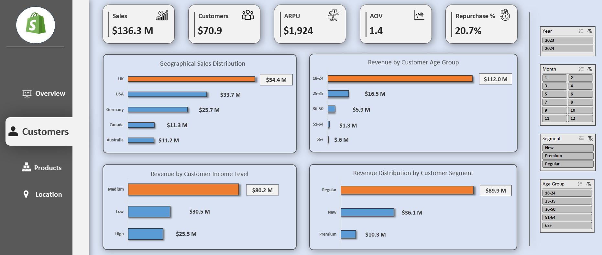
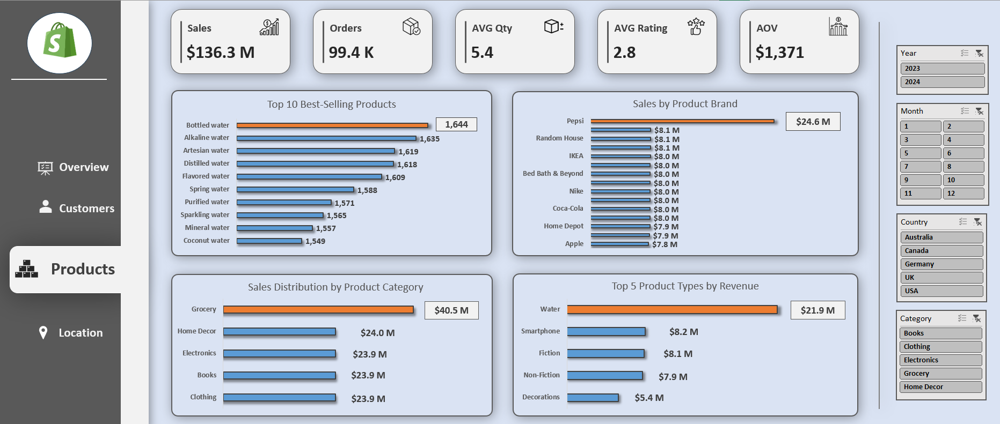
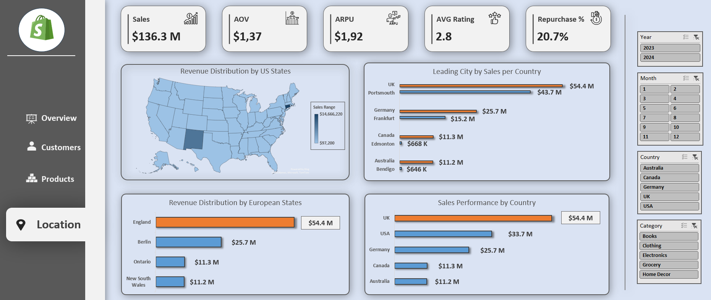
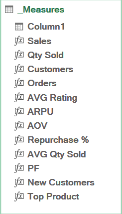

# Marketing & Sales Analytics per Retail

## Table of Contents
- [Description](#description)
- [Data Model](#data-model)
- [Dashboard Preview](#dashboard-preview)
- [DAX Measures](#dax-measures)
- [Case Study Questions](#case-study-questions)
- [Key Findings](#key-findings)
- [Business Recommendations](#business-recommendations)
- **Resources / Files**
  - [Dataset](https://github.com/Aleksandre2221/DA_Portfolio_Projects/tree/main/Excel_Projects/Marketing_&_Sales_Analytics_per_Retail/Dataset)
  - [Screenshots](https://github.com/Aleksandre2221/DA_Portfolio_Projects/tree/main/Excel_Projects/Marketing_&_Sales_Analytics_per_Retail/Screenshots)
  - [DAX Measures](https://github.com/Aleksandre2221/DA_Portfolio_Projects/blob/main/Excel_Projects/Marketing_%26_Sales_Analytics_per_Retail/DAX_Measures.md)
  - [Dashboard](https://github.com/Aleksandre2221/DA_Portfolio_Projects/tree/main/Excel_Projects/Marketing_&_Sales_Analytics_per_Retail/Dashboard)

## Description
This project focuses on analyzing sales data to understand business performance, customer behavior, product trends, and geographical distribution.

The dataset contains over **100,000** records and was modeled using a structured data approach to ensure efficient analysis. The report is divided into **four** main sections: **Overview**, **Customers**, **Products**, and **Location**.

The goal was to identify key revenue drivers, uncover patterns across different customer segments and products, and highlight potential risks such as high dependency on specific markets.

Using data modeling and calculated metrics, the analysis provides clear insights and practical recommendations to support better decision-making and identify growth opportunities.

---

## Data Model   

----

## Dashboard Preview

- ### Overview

---- 
- ### Customers

---- 
- ### Products

---- 
- ### Location

---- 
- ### DAX Measures

---  

## Case Study Questions
- Overview Analysis: How is the overall business performing in terms of revenue trend, seasonality, and key growth patterns?
- Customer Analysis: Who are the main customer groups (age, income, segment), and which ones generate the most revenue?
- Product Analysis: Which product categories, types, and brands drive the most sales and revenue?
- Location Analysis: Which countries, regions, and cities contribute the most to revenue, and how concentrated are sales geographically?
 
## Key Findings
- Revenue is highly concentrated geographically, showing strong dependecy on specific locations:
  - The UK drives **~40%** of total sales, with most revenue coming from a single city - **Portshmouth**
  - **~60%** of Germany sales come from - **Frankfurt**
  - In the US, sales are mostly evenly distributed, except for **Connecticut ($14.6M)** and **New Mexico (~$9M)**, which clearly stand out 
---
- The Business relies havily on **Young** customers (18-24)
  - This age group drives over **80%** of revenue, making it the core customer segment
---
- Sales are dominated by **Regular** customers
  - Most revenue (**~$90M**)comes from **Regular** customers, while **Premium** customers contribute much less (**~$10M**)
---
- Revenue is **Stable** accross the year, with small ups and downs
  - There's a drop in **September**, followed by a strong revocery in October
--- 
- **Grocery** is the top category
  - Generate over **$40M** - around **30%** of total revenue
---
- **Water** is the best performing product type
  - **9** out of top 10 product are water-related
---
- **Pepsi** is the leading brand
  - Woth **$25M** in sales - **~18%** of total revenue

## Business Recommendations
- Reduce geographical dependency: Expand and strengthen underperforming regions to balance revenue distribution
- Diversify the customer base: Target older age groups to reduce reliance on the 18–24 segment
- Increase value of premium customers: Introduce loyalty programs or benefits to increase Premium customer share
- Fix the September drop: Run promotions or campaigns before and during September to smooth the decline
- Expand beyond core products: Promote and develop non-dominant categories to reduce product dependency
- Capitalize on top brands (Pepsi): Use partnerships, bundles, or promotions to maximize their performance
