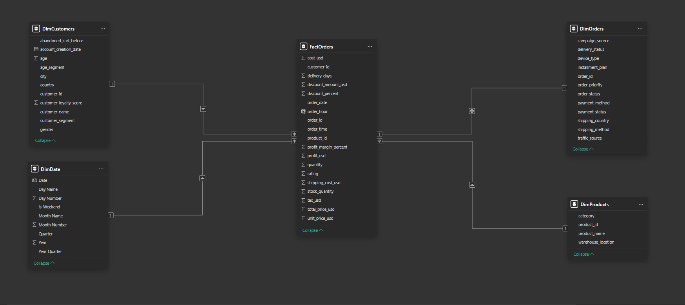
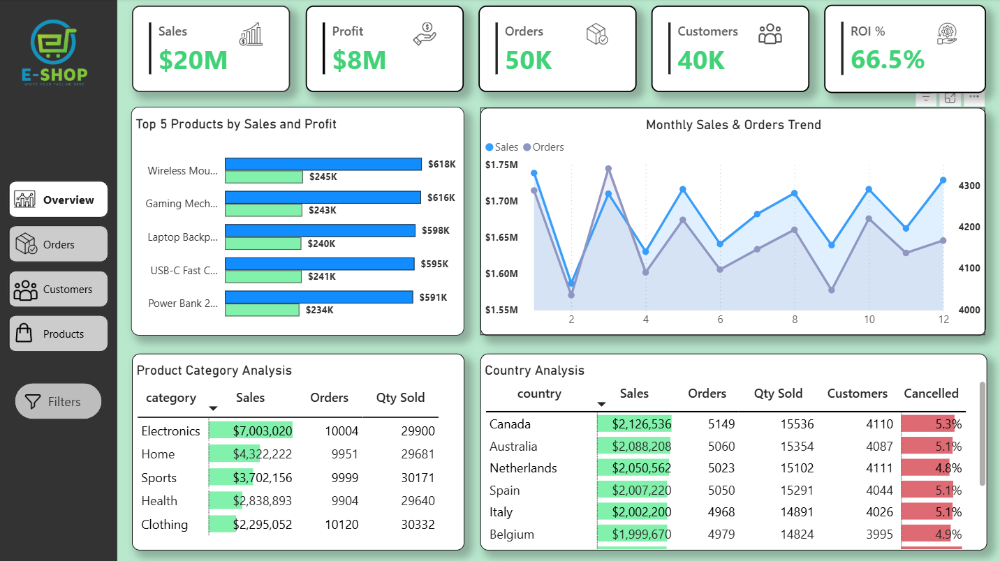
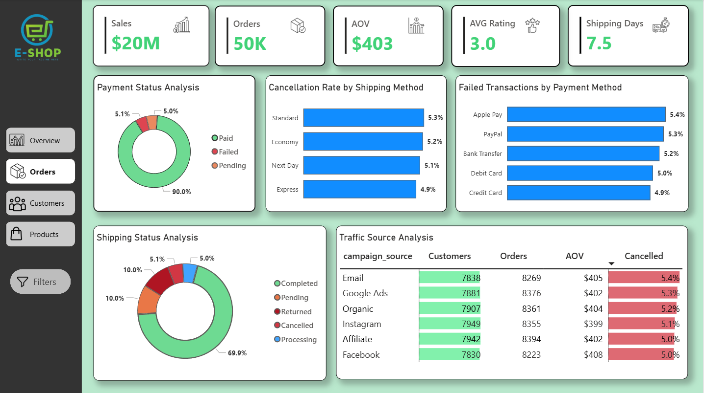
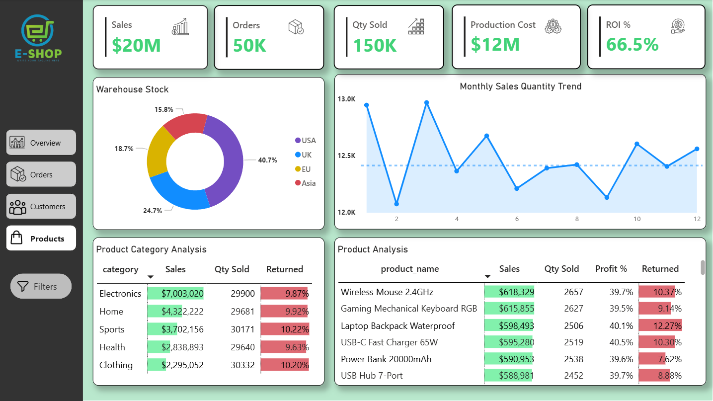
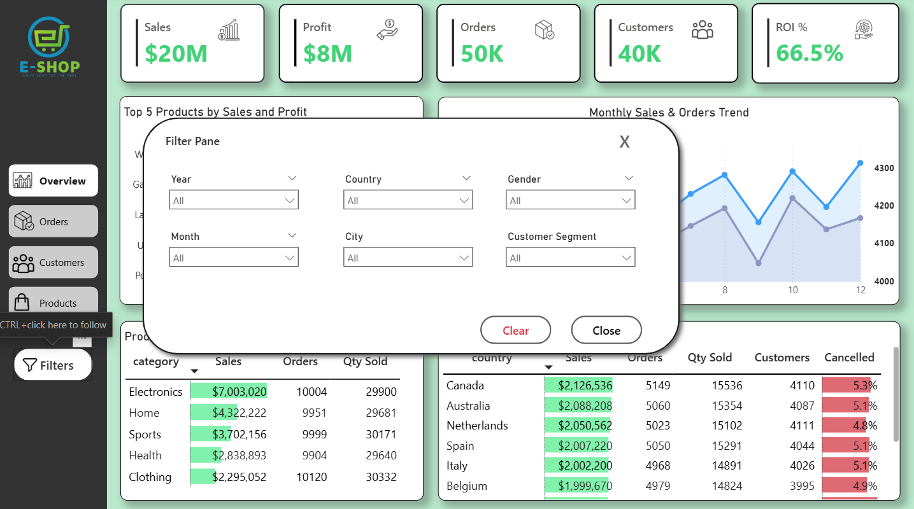
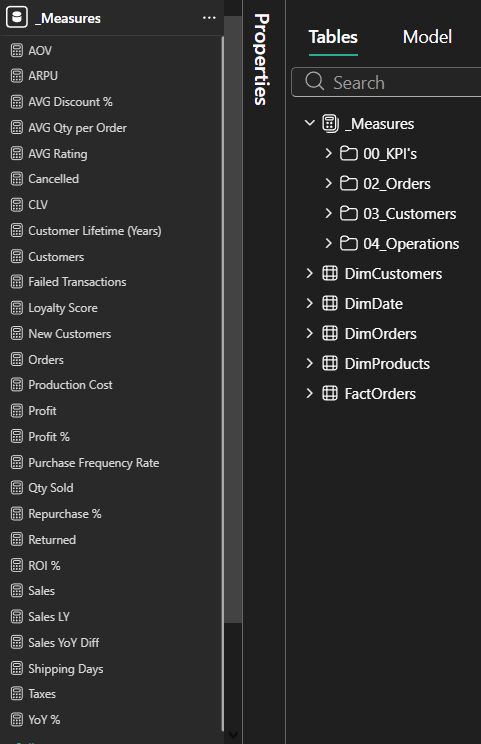

# Online Retail Sales Analysis

## Table of Contents
- [Description](#description)
- [Data Preparation (Power Query)](#data-preparation-power-query)
- [Data Model](#data-model)
- [Dashboard Preview](#dashboard-preview)
- [DAX Measures](#dax-measures)
- [Case Study Questions](#case-study-questions)
- [Key Findings](#key-findings)
- [Business Recommendations](#business-recommendations)
- **Resources / Files**
  - [Dataset](https://github.com/Aleksandre2221/DA_Portfolio_Projects/tree/main/PowerBI_Projects/Online_Retail_Sales_Analysis/Dataset)
  - [Images](https://github.com/Aleksandre2221/DA_Portfolio_Projects/blob/main/PowerBI_Projects/Online_Retail_Sales_Analysis/Images)
  - [DAX Measures](https://github.com/Aleksandre2221/DA_Portfolio_Projects/blob/main/PowerBI_Projects/Online_Retail_Sales_Analysis/DAX_Measures.md)
  - [Dashboard](https://github.com/Aleksandre2221/DA_Portfolio_Projects/tree/main/PowerBI_Projects/Online_Retail_Sales_Analysis/Dashboard)

## Description
This project presents an **interactive Power BI dashboard** designed to analyze **sales performance, customer behavior, and operational efficiency** across multiple stores.

The dashboard enables stakeholders to:
- Monitor **key business KPIs** such as Revenue, Orders, Customers, AOV, ARPU, and CLV  
- Analyze sales trends by **store, product category, brand, and time period**
- Evaluate the **impact of discounts, sales channels, and shipping performance**
- Support **data-driven decisions** related to pricing, inventory, and staff performance

The Power BI report consists of three pages:
- Overview — overall sales, customer, categories and store performance
- Products — detailed product sales analysis: Top products by gross revenue, category, subcategory and brand performance 
- Stores — advanced store-level performance analysis  

The dashboard provides insights such as:
- Total revenue and profit analysis
- Sales by store, category, subcategory, brand and country
- Top-performing and low-performing products
- Quarterly performance trends
- Discount impact on revenue 

---

## Data Preparation (Power Query)
- Main transformations performed:
  - Data cleaning  
  - Handling null values  
  - Merge / Append operations  
  - Data type adjustments  
  - Added calculated columns  

---

## Data Model   

----

## Dashboard Preview

- ### Overview

---- 
- ### Orders

---- 
- ### Customers

---- 
- ### Products

---- 
- ### Filter Pane

---- 
- ### DAX Measures

---  

## Case Study Questions
- Overview Analysis: What is the overall business performance regarding orders, revenue, customer activity, and operational efficiency?
- Order Analysis: How do orders behave across time, locations, and operational factors such as shipping, payments, and order status?
- Customer Analysis: Who are the Company's customers, how are they segmented, and how do different customer groups contribute to revenue?
- Product Analysis: Which Products and Categories drive the most revenue and sales volume?
 
## Key Findings 
- Tutti i Business Insights che hai trovato (Es: “Lo store X mostra un calo del 15% nelle vendite di biciclette elettriche, suggerendo un focus su promozioni mirate”)

## Business Recommendations
- suggerimenti attuabili basati sui dati, come strategie di pricing, inventario o incentivi al personale.
